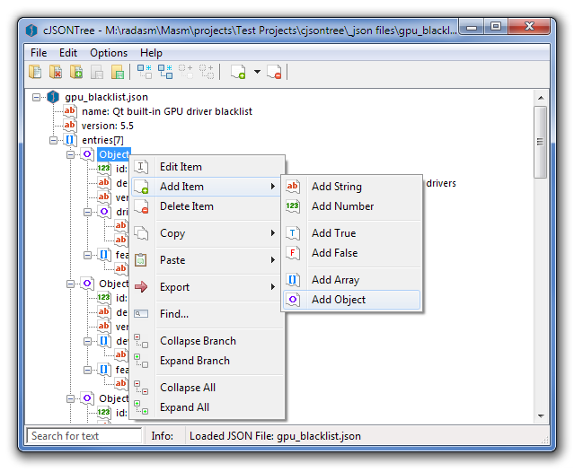

#  cjsontree x86

Application that utilizes cJSON (https://github.com/DaveGamble/cJSON) for reading .json files and displaying the nodes in a treeview control.



Built with the following statically compiled libraries:

- json v1.7.12 x86 (https://github.com/mrfearless/libraries/tree/master/cJSON)
- VirtualStack x86 (https://github.com/mrfearless/libraries/tree/master/VirtualStack)
- Treeview x86 (https://github.com/mrfearless/libraries/tree/master/Treeview)
- Masm32 x86 (http://masm32.com/download.htm)

From a post on tuts4you.com: https://forum.tuts4you.com/topic/39996-how-to-read-json-correctly/

# Download

The latest release can be downloaded [here](https://github.com/mrfearless/cjsontree/blob/master/cjsontree.exe?raw=true), or via the [releases](https://github.com/mrfearless/cjsontree/releases) section of this Github repository.

# File assocation

To automatically associated `.json` files with cjsontree you can edit the `json_cjsontree_cmdlineopen.reg` file or create a new .reg file and adjust the paths (`X:\\path_to_cjsontree`) required to point to where your `cjsontree.exe` is located

```
Windows Registry Editor Version 5.00

[HKEY_LOCAL_MACHINE\SOFTWARE\Classes\.json]
@="cjsontree"

[HKEY_LOCAL_MACHINE\SOFTWARE\Classes\cjsontree]

[HKEY_LOCAL_MACHINE\SOFTWARE\Classes\cjsontree\DefaultIcon]
@=""X:\\path_to_cjsontree\\cjsontree\\cjsontree.exe",0"

[HKEY_LOCAL_MACHINE\SOFTWARE\Classes\cjsontree\shell]

[HKEY_LOCAL_MACHINE\SOFTWARE\Classes\cjsontree\shell\open]
"Icon"=""X:\\path_to_cjsontree\\cjsontree.exe",0"
@="&Open with cjsontree"

[HKEY_LOCAL_MACHINE\SOFTWARE\Classes\cjsontree\shell\open\command]
@=""X:\\path_to_cjsontree\\cjsontree\\cjsontree.exe" \"%1\" "
```

Assigning `.json` files to cjsontree will allow you to double click on a `.json` file for it to automatically open in cjsontree.